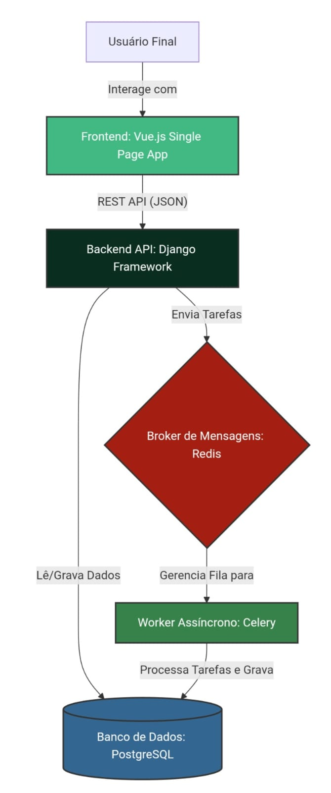
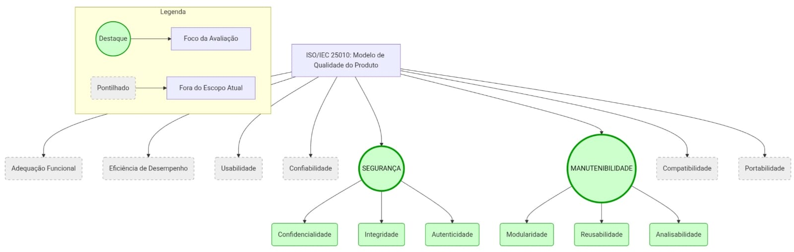

# Fase 1: Resultados Esperados

## Visão Geral

Esta seção descreve os resultados esperados ao final da Fase 1 (Definição dos Requisitos de Avaliação da Qualidade). Os resultados servirão como base para as próximas fases e serão documentados tanto nesta GitPages quanto no relatório técnico a ser enviado ao Moodle.

## Resultados Esperados
### **1. Requisitante e Partes Interessadas**

O mapeamento estruturado das partes interessadas reflete as necessidades reais do contexto acadêmico do AcheiUnB e dita a priorização das características de qualidade da avaliação.

| Parte Interessada                                            | Papel e Necessidades                                                                                                                 | Influência na Priorização da Avaliação                                                                             |
| ------------------------------------------------------------ | ------------------------------------------------------------------------------------------------------------------------------------ | ------------------------------------------------------------------------------------------------------------------ |
| **Equipe de Qualidade (Requisitante)**                       | Através da disciplina de Qualidade de Software, audita o sistema exigindo métricas rigorosas baseadas na ISO/IEC 25010.              | Define o escopo e as características avaliadas; exige dados auditáveis e rastreáveis no repositório.               |
| **Universidade de Brasília (Cliente)**                       | Instituição que se beneficia do sistema para otimizar o fluxo de itens perdidos; exige respeito rigoroso à proteção de dados (LGPD). | Justifica a prioridade **Alta** de Segurança: o sistema processa dados pessoais sujeitos à LGPD.                   |
| **Mantenedores e Comunidade (Fornecedores/Desenvolvedores)** | Desenvolvedores atuando em ambiente acadêmico/Open Source; precisam de código limpo e infraestrutura modular.                        | Justifica a prioridade **Alta** de Manutenibilidade: alta rotatividade exige código compreensível a cada semestre. |
| **Segurança e Recepção da UnB (Operadores)**                 | Funcionários da universidade que registram e gerenciam os itens físicos através do painel do sistema.                                | Reforça a necessidade de disponibilidade contínua do sistema e ausência de falhas críticas de acesso.              |
| **Comunidade Acadêmica (Usuários Finais)**                   | Estudantes e servidores que interagem com o sistema e trocam mensagens via chat.                                                     | Justifica a inclusão de acessibilidade no escopo de Manutenibilidade (G2), garantindo uso por todos os perfis.     |

Além disso, a avaliação contempla dois focos principais de segurança:

- **Segurança Profunda (SAST):** mitigar vulnerabilidades críticas de credenciais expostas (_Hardcoded Secrets_).
- **Segurança de Borda (DAST):** configurar cabeçalhos de segurança essenciais no servidor, como CSP e Anti-clickjacking, além de corrigir o vazamento de recursos via CORS.

### **2. Descrição Estruturada do AcheiUnB**

O **AcheiUnB** é um sistema voltado à devolução de pertences no campus **FCTE da Universidade de Brasília**, organizado em módulos que se comunicam entre si para garantir o funcionamento da aplicação.

*Figura 1: Arquitetura do Sistema AcheiUnB (Vue.js, Django, Redis, Celery e PostgreSQL).*

> **Nota de Implicação:** Devido à conteinerização via Docker e ao uso de workers assíncronos (Celery), a avaliação atual foca na segurança da borda da API e na análise estática do código, deixando métricas de desempenho de rede externa fora deste escopo.

#### **Módulos da Arquitetura**

- **Módulo de Apresentação (Frontend)**
  - Desenvolvido em **Vue.js**.
  - Utiliza **Vite** como ferramenta de build e desenvolvimento.
  - Utiliza **Tailwind CSS** para estilização da interface.
  - Responsável por:
    - Exibir as telas da aplicação;
    - Permitir a interação do usuário com o sistema;
    - Renderizar informações vindas da API.

- **Módulo de Lógica e Integração (Backend)**
  - Desenvolvido em **Python** com **Django REST Framework**.
  - Atua como a API principal do sistema.
  - Responsável por:
    - Centralizar as regras de negócio;
    - Gerenciar autenticação de usuários;
    - Controlar permissões de acesso;
    - Integrar o frontend com os dados persistidos.

- **Módulo Assíncrono e Mensageria**
  - Suporta a funcionalidade de **chat em tempo real**.
  - Utiliza **Django Channels** e **WebSockets**.
  - Conta com apoio de:
    - _Workers_ do **Celery**;
    - Filas em **Redis**.
  - Responsável por:
    - Comunicação em tempo real;
    - Processamento assíncrono;
    - Suporte a tarefas que não precisam ser executadas diretamente na requisição principal.

- **Módulo de Persistência e Orquestração**
  - Utiliza **PostgreSQL** como banco de dados.
  - A infraestrutura é empacotada e isolada com **Docker**.
  - A orquestração dos serviços é feita via **Docker Compose**, por meio do arquivo `docker-compose.yml`.
  - Responsável por:
    - Armazenar os dados da aplicação;
    - Organizar os serviços necessários para execução do sistema;
    - Facilitar a reprodução do ambiente de desenvolvimento.

### **3. Modelo de Qualidade e Características Escolhidas**

O modelo adotado baseia-se na norma **ISO/IEC 25010 (SQuaRE)**.

Conforme exigido pelas premissas iniciais do projeto, a avaliação concentra-se exclusivamente em características **intrínsecas** e **internas** do código.

*Figura 2: Adaptação do Modelo ISO/IEC 25010. As características em destaque (verde) representam o escopo da avaliação atual. As demais foram suprimidas pontualmente para focar nas necessidades mais críticas dos stakeholders e na segurança dos dados (LGPD).*

#### **3.0. Características excluídas e justificativa**

A adaptação do modelo ISO/IEC 25010 ao contexto do AcheiUnB implicou na exclusão deliberada de características não aplicáveis ou inviáveis neste ciclo de avaliação:

| Característica ISO/IEC 25010 | Motivo da exclusão |
| --- | --- |
| **Usabilidade** | Excluída por orientação expressa da disciplina. |
| **Desempenho e Eficiência** | O sistema não possui SLA formal; o ambiente Docker/Celery em máquina local inviabiliza medições de tempo reproduzíveis. |
| **Compatibilidade** | O AcheiUnB não possui integrações externas a auditar neste ciclo; roda exclusivamente como aplicação web. |
| **Portabilidade** | O sistema opera exclusivamente em ambiente conteinerizado (Docker) sem variação de plataforma prevista. |
| **Confiabilidade** | Não há histórico de incidentes em produção disponível para cálculo de métricas como MTBF ou taxa de falha. |

#### **3.1. Segurança (_Security_)**

- **Prioridade:** Alta.

- **Justificativa:** O sistema processa dados acadêmicos sensíveis e _chats_ privados.
  - Falhas de segurança podem permitir:
    - Sequestro de contas;
    - Extração de chaves de infraestrutura.

- **Critério e Aplicação:** Avaliada de forma dupla:
  - **Visão SAST (SonarCloud - Análise Estática):**
    - A análise profunda do código revelou um cenário crítico de exposição de credenciais (**Blockers**).
    - Foram detectadas senhas comprometidas escritas diretamente nos arquivos de teste do backend:
      - `test_views.py`;
      - `test_serializers.py`;
      - `test_models.py`.
    - Também foi identificado vazamento da **Django Secret Key** no arquivo `settings_production.py`.
    - Além disso, houve exposição indevida de uma chave privada de certificado:
      - `localhost.key`.

  - **Visão DAST (OWASP ZAP - Análise Dinâmica na porta 5173):**
    - Foram mapeados:
      - `0` alertas de **Risco Alto**;
      - `3` alertas de **Risco Médio**;
      - `5` alertas de **Risco Baixo**.

    - **Risco Médio:**
      - Configuração sistêmica insegura de **CORS**, permitindo origens forjadas;
      - Ausência de Política de Segurança de Conteúdo:
        - `CSP Header Not Set`;
      - Ausência de proteção contra clickjacking:
        - `Anti-clickjacking Header`;
        - `X-Frame-Options`.

    - **Risco Baixo (_Hardening_):**
      - Falta de cabeçalhos contra ataques paralelos:
        - `Cross-Origin-Resource-Policy`;
        - `Cross-Origin-Embedder-Policy`;
        - `X-Content-Type-Options`.

#### **3.2. Manutenibilidade (_Maintainability_)**

- **Prioridade:** Alta.

- **Justificativa:** A alta complexidade da _stack_ tecnológica e a rotatividade de desenvolvedores exigem que o sistema seja altamente compreensível para garantir sua evolução nos próximos semestres.

- **Critério e Aplicação:** Foco nas subcaracterísticas de:
  - **Analisabilidade**;
  - **Modificabilidade**;
  - **Testabilidade**.

  - **Visão SAST (SonarCloud):**
    - A varredura identificou **184 apontamentos abertos**.
    - A dívida técnica total acumulada foi de **2.270 minutos**, aproximadamente **37,8 horas**.
    - A **Analisabilidade** é prejudicada por uma forte sobrecarga cognitiva.
    - Componentes Vue críticos atingiram pontuações de complexidade ciclomática de `27`, quando o limite aceitável é `15`:
      - `Form-Found.vue`;
      - `Form-Lost.vue`.

    - Também foram identificados problemas como:
      - Incidência de código duplicado no backend;
      - Literais de e-mail repetidos;
      - Mensagens de erro repetidas;
      - Falta de higiene de código;
      - Arquivos CSS vazios;
      - _Imports_ declarados, mas não utilizados;
      - Variáveis declaradas, mas não utilizadas.

### **4. Escopo, Profundidade e Objetivos de Avaliação**

- **Objeto de Avaliação:** A instância do frontend em execução (`http://localhost:5173`) e a base de código integral do repositório.
  - Foram considerados:
    - Arquivos Vue;
    - Rotas Python/Django;
    - Arquivos de testes.

- **Escopo:** Avaliação estática e dinâmica de qualidade e segurança.
  - A avaliação segue uma abordagem de **Shift-Left Security**.
  - O objetivo é garantir:
    - Auditoria estrutural do código;
    - Auditoria da camada de rede;
    - Identificação antecipada de falhas de segurança e qualidade.

- **Profundidade:** Análise em duas camadas:
  - **Camada de superfície e integração (DAST):**
    - Validou a blindagem dos _endpoints_ contra injeções de terceiros.
    - Identificou problemas relacionados à ausência ou má configuração de:
      - CSP;
      - CORS.

  - **Camada profunda (SAST):**
    - Realizou uma varredura rigorosa de código.
    - Detectou falhas sistêmicas, como:
      - Credenciais _hardcoded_;
      - Código espaguete no _frontend_.

#### **Fora do Escopo**

As seguintes dimensões foram deliberadamente excluídas, com justificativa:

- **Testes funcionais e de aceitação:** estão além do propósito desta avaliação, que foca em atributos intrínsecos do produto (segurança e manutenibilidade do código).
- **Métricas de desempenho (tempo de resposta, throughput):** o ambiente acadêmico local não garante condições controladas para medições válidas e reproduzíveis.
- **Análise do banco de dados PostgreSQL:** o escopo limitou-se ao código-fonte e à camada de apresentação, onde os riscos são mais críticos e mensuráveis com SAST/DAST.
- **Cobertura de testes automatizados:** não há pipeline de testes configurado no repositório que permita medir esta subcaracterística de forma auditável.

- **Relação com Avaliações Futuras e Plano de Ação:** O sucesso desta etapa dita as prioridades imediatas do projeto.
  - As ações prioritárias são:
    - Remover as chaves expostas;
    - Configurar os cabeçalhos de segurança;
    - Tratar requisitos bloqueantes antes da evolução do projeto.

  - Cabeçalhos de segurança prioritários:
    - CSP;
    - `X-Frame-Options`.

  - A configuração pode ser realizada via:
    - Nginx;
    - Django Middleware.

  - Esses ajustes são necessários antes que o projeto avance de forma segura para:
    - Testes funcionais;
    - Homologação.

### **5. ODS Relacionados**

O **AcheiUnB**, em sua missão e operação técnica, alinha-se aos seguintes Objetivos de Desenvolvimento Sustentável da Agenda 2030 da Organização das Nações Unidas (ONU):

#### **5.1. ODS 12 - Consumo e Produção Responsáveis**

- **Justificativa:** O AcheiUnB viabiliza o retorno de pertences perdidos a seus donos, reduzindo o descarte prematuro de bens e a compra de substitutos desnecessários. Um sistema com falhas críticas de segurança — como as identificadas nesta avaliação (M1.2 = Insuficiente, credenciais expostas) — que force o sistema a ficar fora do ar ou seja comprometido interrompe diretamente esse ciclo de devolução, gerando impacto real no consumo.

- **Meta:** 12.5 — *Reduzir substancialmente a geração de resíduos por meio da prevenção, redução, reciclagem e reuso.*

- **Indicador aplicado à avaliação:** A avaliação de Segurança e Manutenibilidade garante que o sistema permaneça operacional e confiável a longo prazo, condição necessária para que o ciclo de devolução de itens funcione continuamente. As ações recomendadas na Fase 4 (saneamento de credenciais e redução de complexidade cognitiva) contribuem diretamente para a sustentabilidade operacional do sistema.

#### **5.2. ODS 16 - Paz, Justiça e Instituições Eficazes**

- **Justificativa:** O AcheiUnB processa dados pessoais de identificação de estudantes e servidores da UnB, sujeitos à LGPD. A auditoria realizada nesta avaliação — identificando credenciais expostas nos arquivos de teste (`test_views.py`, `test_models.py`) e ausência de cabeçalhos de proteção HTTP — evidencia não-conformidades que comprometem a responsabilidade institucional da UnB no tratamento de dados pessoais.

- **Meta:** 16.10 — *Assegurar o acesso público à informação e proteger as liberdades fundamentais, em conformidade com a legislação nacional e os acordos internacionais.*

- **Indicador aplicado à avaliação:** A métrica M1.2 (BLOCKERs de segurança > 0, nível Insuficiente) e M1.1 (densidade de alertas DAST = 0,27, nível Insuficiente) evidenciam que o sistema, no estado avaliado, não atende ao padrão mínimo de proteção de dados exigido para uma instituição pública eficaz. O plano de ação da Fase 4 direciona as correções necessárias para alinhar o sistema à meta 16.10.

---

## Histórico de Versões

| Versão | Descrição                                                               | Data       | Responsável                                                            |
| ------ | ----------------------------------------------------------------------- | ---------- | ---------------------------------------------------------------------- |
| `0.1`  | Criação do template para Resultados Esperados da Fase 1.                | 12/05/2026 | [Júlia](https://github.com/juliamassuda)                               |
| `0.2`  | Adição das seções 1,2,3 e 4 dos Resultados Esperados da Fase 1          | 12/05/2026 | [Tiago Antunes](https://github.com/tiagobalieiro)                      |
| `0.3`  | Adição da seção 5 (ODS Relacionados) dos Resultados Esperados da Fase 1 | 13/05/2026 | [João Pedro Rodrigues Gomes da Silva](https://github.com/JpRodrigues2) |
| `0.4`  | Adição das imagens em Resultados Esperados da Fase 1 | 13/05/2026 | [Marjorie Mitzi](https://github.com/Marjoriemitzi) |
| `0.5`  | Correções EU3: coluna de influência na tabela de stakeholders, tabela de características excluídas do modelo ISO, seção "Fora do Escopo" e reforço dos indicadores ODS com métricas da Fase 4. | 23/06/2026 | [Júlia Massuda](https://github.com/JuliaReis18) |
