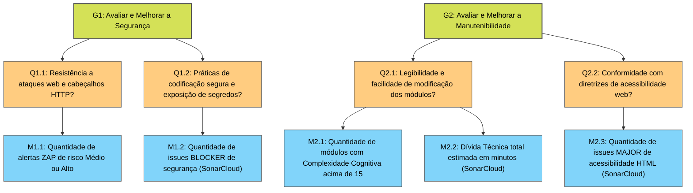

# Fase 2: Objetivos de Medição GQM

## Visão Geral

Esta seção define os **Objetivos de Medição** do AcheiUnB utilizando a abordagem **GQM (Goal, Question, Metric)**. A partir das características de qualidade priorizadas na [Fase 1 — Objetivo da Avaliação](../fase1/objetivo.md), foram estruturados dois objetivos que orientam toda a coleta quantitativa realizada nas Fases 3 e 4.

A hierarquia GQM organiza a avaliação em três níveis:

| Nível | Elemento | Papel na Avaliação |
| :---: | :------: | :----------------- |
| **Conceitual** | Objetivo (G) | O que se deseja avaliar e por quê |
| **Operacional** | Questão (Q) | Como operacionalizar o objetivo em perguntas mensuráveis |
| **Quantitativo** | Métrica (M) | O dado numérico que responde a cada questão |

---

## 1. Objetivos de Medição (C1)

### Objetivo G1 — Segurança

| Campo GQM | Definição |
| --------- | --------- |
| **Analisar** | A infraestrutura web, as rotas da API e o código-fonte do sistema AcheiUnB |
| **Para** | Avaliar e melhorar |
| **Com respeito a** | Segurança — proteção contra vazamento de dados sensíveis, controle de acesso, exposição de credenciais no repositório e configuração de cabeçalhos HTTP |
| **Do ponto de vista de** | Usuários finais (estudantes e comunidade universitária) e Equipe de Desenvolvimento |
| **No contexto de** | Uma aplicação web acadêmica destinada ao gerenciamento de achados e perdidos, que processa e armazena dados pessoais sujeitos à LGPD |

### Objetivo G2 — Manutenibilidade

| Campo GQM | Definição |
| --------- | --------- |
| **Analisar** | A base de código-fonte do frontend (Vue.js) e do backend (Django/Python) do AcheiUnB |
| **Para** | Avaliar e melhorar |
| **Com respeito a** | Manutenibilidade e Acessibilidade — controle da dívida técnica, redução da complexidade cognitiva dos módulos e cumprimento de diretrizes de acessibilidade da interface |
| **Do ponto de vista de** | Desenvolvedores atuais e futuros mantenedores do sistema |
| **No contexto de** | Um projeto de software em ambiente acadêmico com alta rotatividade de desenvolvedores a cada semestre, onde a legibilidade do código é vital para a continuidade do ciclo de vida do produto |

---

## 2. Questões e Hipóteses (C2 e C3)

Para cada objetivo, foram formuladas questões operacionais que cobrem os atributos do foco de qualidade. A cada questão corresponde uma hipótese definida antes do início da medição formal, estabelecendo o comportamento esperado do sistema.

### 2.1. Questões referentes ao Objetivo G1 (Segurança)

**Q1.1** — O sistema possui uma postura resiliente contra ataques comuns em aplicações web, como interceptação de sessões e execução de scripts não autorizados?

> **Hipótese H1.1:** Espera-se que a aplicação não apresente falhas críticas de injeção de código (como SQL Injection), mas que possua vulnerabilidades de nível médio relacionadas à configuração de infraestrutura — em especial, ausência de cabeçalhos de proteção (`Content-Security-Policy` e restrições de `CORS`) adequados para o ambiente de produção.

**Q1.2** — Existem falhas nas práticas de codificação segura que exponham o sistema a acessos não autorizados por meio da base de código?

> **Hipótese H1.2:** Espera-se encontrar credenciais sensíveis (senhas, chaves de API ou tokens) fixadas diretamente no código-fonte (_hardcoded_), particularmente nos arquivos de teste do Django ou em arquivos de configuração versionados indevidamente no repositório.

### 2.2. Questões referentes ao Objetivo G2 (Manutenibilidade)

**Q2.1** — A arquitetura interna e a escrita dos módulos facilitam a compreensão, modificação e adição de novas funcionalidades por novos desenvolvedores?

> **Hipótese H2.1:** Espera-se identificar uma dívida técnica acumulada moderada, impulsionada principalmente pela alta complexidade cognitiva em arquivos centrais do projeto — como as _views_ do Django e os formulários principais em Vue.js — que concentram múltiplas responsabilidades e estruturas condicionais aninhadas.

**Q2.2** — A interface do usuário está construída seguindo as diretrizes de acessibilidade web, permitindo o uso adequado por tecnologias assistivas?

> **Hipótese H2.2:** Espera-se que haja deficiências na estruturação do HTML no frontend, especialmente a falta de associação correta entre rótulos (`<label>`) e elementos de formulário (`<input>`), prejudicando a experiência de usuários que dependem de leitores de tela.

---

## 3. Hierarquia GQM (C6)

O diagrama abaixo ilustra o desdobramento lógico dos Objetivos em Questões operacionais e destas para as Métricas quantitativas coletadas na Fase 4. As definições completas de cada métrica, seus limiares e critérios de julgamento estão na seção [Métricas e Critérios](metricas-criterios.md).

*Figura 1: Hierarquia GQM do AcheiUnB — desdobramento dos Objetivos (amarelo) em Questões (laranja) e Métricas (azul).*

---

## 4. Rastreabilidade e Coerência com a Fase 1 (C11)

Os objetivos de medição desta fase derivam diretamente das prioridades, dos stakeholders e dos dados preliminares definidos na [Fase 1 — Objetivo da Avaliação](../fase1/objetivo.md) e nos [Resultados Esperados da Fase 1](../fase1/resultados.md). A consistência entre as fases não é apenas estrutural — cada escolha conceitual desta fase é justificada pelo que foi observado na fase anterior.

### 4.1. Derivação do Objetivo G1 (Segurança)

O **Objetivo G1** deriva diretamente do **Propósito Específico da Avaliação** estabelecido na Fase 1:

> *"Determinar o nível de qualidade e a resiliência arquitetural do sistema AcheiUnB nas dimensões críticas de Segurança e Manutenibilidade."*

A Fase 1 revelou, por meio da análise SAST (SonarCloud), **11 issues do tipo BLOCKER**, incluindo:

- Exposição da `Django Secret Key` no arquivo `settings_production.py`;
- Vazamento do arquivo de chave privada `localhost.key`;
- Credenciais de teste fixadas nos arquivos `test_views.py` e `test_models.py`.

A análise DAST (OWASP ZAP) identificou ainda **3 alertas de risco Médio** ligados à ausência de cabeçalhos HTTP essenciais: `Content-Security-Policy`, `X-Frame-Options` e a configuração permissiva de `CORS`.

O **ponto de vista dos usuários finais** — estudantes e comunidade acadêmica — foi escolhido porque são eles os mais diretamente afetados por falhas de segurança: têm dados de identificação pessoal e de localização física expostos em caso de violação, e o sistema está obrigado à **LGPD** por processar esses dados. O **ponto de vista da equipe de desenvolvimento** complementa a perspectiva, pois as práticas de codificação insegura (segredos no código-fonte) são responsabilidade direta dos mantenedores.

### 4.2. Derivação do Objetivo G2 (Manutenibilidade)

O **Objetivo G2** e o ponto de vista dos **futuros mantenedores** derivam da justificativa de priorização explicitada na Fase 1:

> *"A alta complexidade da stack tecnológica (Vue.js 3, Django, WebSockets, Redis, Docker) e a rotatividade de desenvolvedores em ambiente acadêmico exigem que o sistema seja altamente compreensível e estruturado para garantir sua evolução sustentável nos próximos semestres."*

A Fase 1 quantificou a dívida técnica em **2.270 minutos (~37,8 horas)** e identificou componentes Vue com complexidade cognitiva de **27** — quase o dobro do limite aceitável de 15 — nos arquivos `Form-Found.vue` e `Form-Lost.vue`. Esses dados tornaram o ponto de vista dos futuros mantenedores o mais relevante: a cada novo semestre, uma turma diferente assume o projeto, e um código com complexidade excessiva representa uma barreira severa de entrada.

A inclusão da **acessibilidade** no Objetivo G2 — e não como um objetivo separado — é justificada por dois motivos: primeiro, porque falhas de acessibilidade são tratadas pelo SonarCloud como issues de manutenibilidade estrutural do HTML (regra `Web:S6853`), compondo a mesma camada de análise das demais métricas de qualidade de código; segundo, porque a **Comunidade Acadêmica** foi mapeada na Fase 1 como stakeholder que inclui estudantes e servidores com diferentes perfis e necessidades, reforçando o compromisso com uma interface universalmente utilizável.

---

## Histórico de Versões

| Versão | Descrição | Data | Responsável |
| ------ | --------- | ---- | ----------- |
| `0.1` | Criação do documento com objetivos de medição GQM, questões, hipóteses, hierarquia GQM e rastreabilidade com a Fase 1. | 05/06/2026 | [Júlia Massuda](https://github.com/juliamassuda) |
