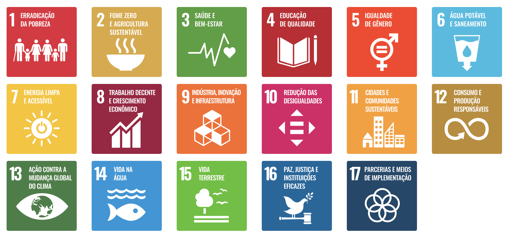

# Kay McNulty - Achei UnB

## Quem Foi Kay McNulty?

Kathleen “Kay” McNulty, pioneira da ciência da computação, foi uma das seis programadoras originais do ENIAC, o primeiro computador digital eletrônico de uso geral. Nascida na Irlanda e criada nos EUA, sua habilidade em matemática a levou a ser recrutada pelo Exército dos EUA como “computadora humana” durante a Segunda Guerra Mundial, calculando trajetórias balísticas de artilharia. Após a conclusão do ENIAC, ela e suas colegas operaram a máquina. Sem linguagens de programação, compiladores ou manuais, Kay configurou o hardware analisando diagramas elétricos, roteando dados e conectando cabos e interruptores.

McNulty e suas colegas foram fundamentais para a engenharia de software, inventando a programação de computadores.  Desenvolveram métodos para traduzir equações matemáticas em passos lógicos para máquinas. Apesar de sua importância, as “Garotas do ENIAC” foram invisibilizadas por décadas, confundidas com modelos, enquanto o crédito ia para os engenheiros do hardware. Hoje, o legado de Kay McNulty é celebrado como prova do papel crucial das mulheres na criação da programação.

 

Kay McNulty, Fonte: [EPIC: The Irish Imigration Museum](https://epicchq.com/story/kay-mcnulty-the-irish-mother-of-computer-programming/)

## Achei UnB

O [AcheiUnB](https://github.com/unb-mds/2024-2-AcheiUnB) é um projeto desenvolvido na disciplina de Métodos de Desenvolvimento de Software pelos estudantes da Universidade de Brasília da Faculdade de Ciências e Tecnologias em Engenharia. Seu objetivo é auxiliar na busca e recuperação de objetos perdidos. 

Na plataforma, os alunos podem registrar itens encontrados ou perdidos com o intuito de facilitar o contato entre quem perdeu e quem achou determinado item. A principal vantagem do AcheiUnB é a capacidade de reduzir a dependência de grupos de mensagens, criando um sistema mais organizado e acessível para relatar os itens achados ou perdidos.

### Características Principais

* **Software Livre:** O código do AcheiUnB está disponibilizado no GitHub, permitindo sua análise e contribuições;
* **Facilitador e intermediador para o reporte e devolução de objetos perdidos e achados:** O AcheiUnB, por ser uma plataforma dedicada ao reporte e devolução de achados e perdidos, evita com que plataformas externas, como o WhatsApp - em grupos de conversa da faculdade -; tenham que reportar os objetos achados e perdidos.

### Objetivos de Desenvolvimento Sustentável (ODS)

Propostos pela Organização das Nações Unidas para atingir a Agenda 2030, os 17 objetivos de desenvolvimento sustentável buscam um melhor desenvolvimento das sociedades dos países que contribuem para as Nações Unidas. Entre os objetivos, estão a erradicação da pobreza, fome zero e agricultura sustentável, saúde e bem-estar, entre outros.

Objetivos de desenvolvimento sustentável propostos pela ONU, Fonte: [ONU Brasil](https://brasil.un.org/pt-br/sdgs)

O AcheiUnB contempla os seguintes objetivos propostos pela ONU:

#### ODS 9 - Indústria Inovação e Infraestrutura

O Achei UnB representa uma inovação tecnológica dos estudantes projetada para resolver um problema de logística e comunicação. A plataforma atua como um facilitador e intermediador para a entrega e registro de objetos perdidos, os quais costumam ser anunciados em grupos de WhatsApp, Telegram e posts no Instagram.

#### ODS 12 - Consumo e Produção Responsáveis

O AcheiUnB, ao ser uma plataforma eficaz para a recuperação de itens perdidos, evita com que os estudantes precisem comprar novos produtos para substituir os perdidos. Dessa forma, o projeto, ajuda a prolongar a vida útil dos materiais e minimizando o consumo desnecessário de novos recursos

#### ODS 16 - Paz, Justiça e Instituições Eficazes

O AcheiUnB atua como uma ferramenta que busca incentivar o comportamento ético e a empatia dos alunos da universidade. Ela facilita ação de que deseja ser honesto e devolver um objeto ao seu verdadeiro dono. Como consequência, a plataforma, promove uma cultura de confiança e cooperação entre os estudantes do campis da universidade.

---

## Equipe de Qualidade de Software - KAY McNULTY

A equipe de qualidade de software é composta por estudantes dedicados da Faculdade de Ciências e Tecnologias em Engenharia da Universidade de Brasília, trabalhando conjuntamente no projeto de avaliação de qualidade do **AcheiUnB**.

### Membros da Equipe

| Foto | Membro | GitHub |
| :--: | :------: | :------: |
|  | **Júlia Massuda** | [@juliamassuda](https://github.com/juliamassuda) |
|  | **Luiz Faria** | [@luizfaria1989](https://github.com/luizfaria1989) |
|  | **Tiago Antunes** | [@TiagoBalieiro](https://github.com/tiagobalieiro) |
|  | **Samuel** | TBD |
|  | **João Pedro Rodrigues Gomes da Silva** | [@JpRodrigues2](https://github.com/JpRodrigues2) |
|  | **Marjorie** | [@Marjoriemitzi](https://github.com/Marjoriemitzi) |

---

| Versão | Descrição | Data | Responsável |
| ------ | --------- | ---- | ----------- |
| `0.1` | Criação da página e início da documentação. | 08/05/2026 | [Luiz](https://github.com/luizfaria1989) |
| `0.2` | Adiciona objetivos de desenvolvimento sustentável e informações do AcheiUnB. | 12/05/2026 | [Luiz](https://github.com/luizfaria1989) |
| `0.3` | Integração da seção de Equipe na página Início e reorganização das abas de navegação. | 12/05/2026 | [Júlia](https://github.com/juliamassuda) |
| `0.4` | Integração da seção de Equipe na página Início. | 12/05/2026 | [Júlia](https://github.com/juliamassuda) |
| `0.5` | Adição de João Pedro Rodrigues Gomes da Silva como membro da equipe. | 13/05/2026 | [João Pedro](https://github.com/JpRodrigues2) |

